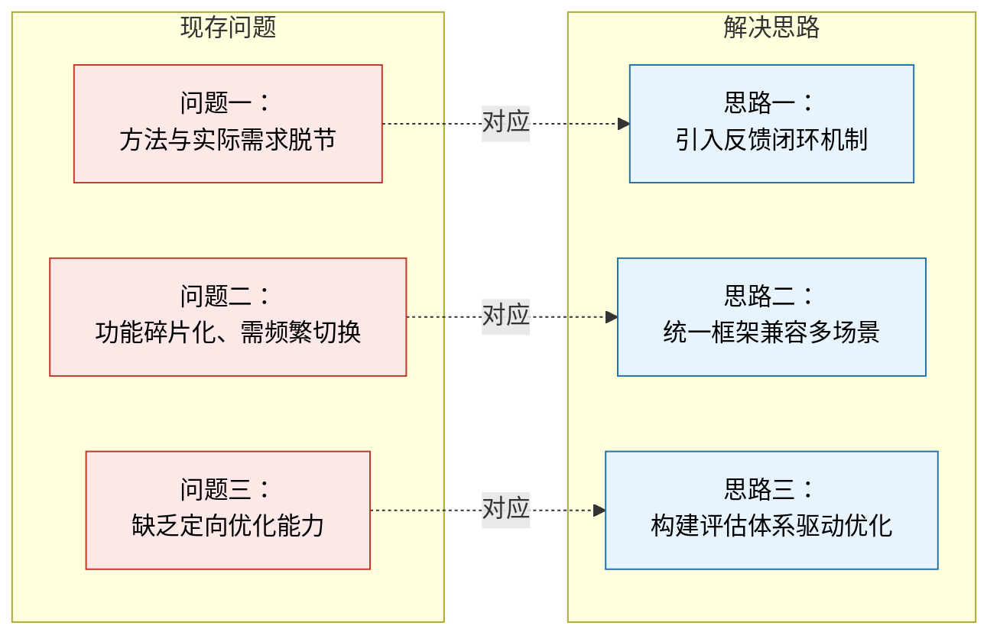
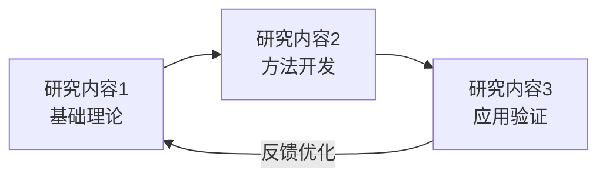
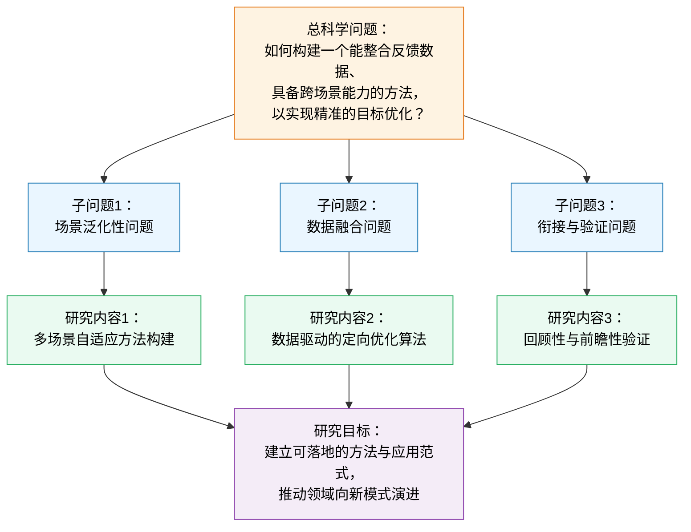
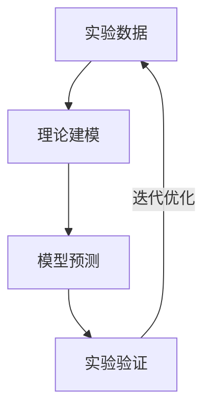
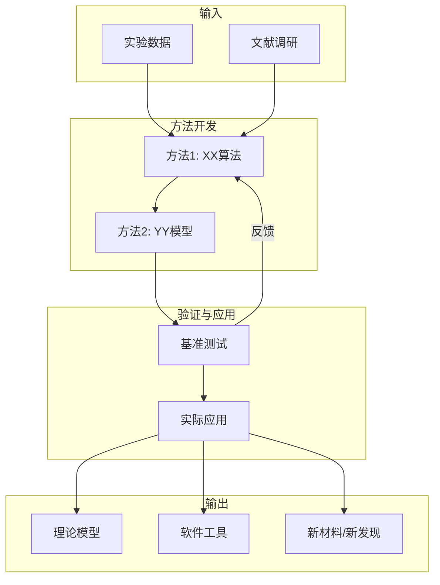
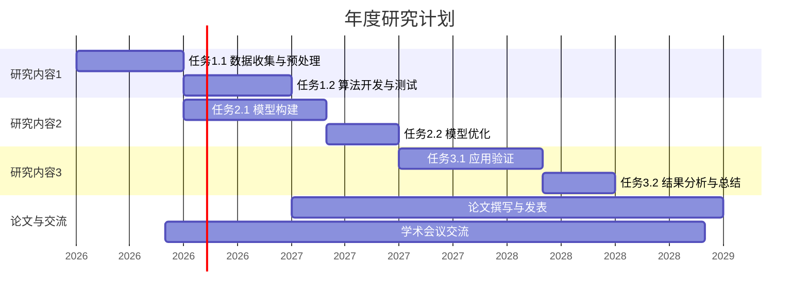

# NSFC 申请书图表制作指南

## 图表的重要性

- **第一张概念图**决定评审人的第一印象
- 图文并茂是评审人明确推荐的做法
- 不要从已发表论文PDF中截图（分辨率差，态度不诚恳）
- 图表要清晰、专业、自洽
- 同一申请书中保持风格和配色一致

---

## 标准配图叙事体系（核心方法论）

一份优秀申请书的图表不是孤立的插图，而是一条贯穿全书的**视觉叙事主线**。评审人常先翻图、后读字——图表叙事是否完整自洽，直接决定第一印象。推荐采用下列经实战检验的标准配图清单，从立项依据一路铺陈到研究基础，每张图各司其职、首尾呼应。

### 标准配图清单表

| 图序 | 位置（正文章节） | 职责（一句话） | 类型 |
|------|------------------|----------------|------|
| 图1 | 立项依据·开篇 | 建立领域背景与研究价值，让大同行一眼看懂"这是什么、为何重要" | 概念 |
| 图2 | 立项依据·承接（提出问题处） | 把"现存问题"与"对应解决思路"左右并置，凸显切入点 | 逻辑 |
| 图3 | 研究内容·拟解决的关键科学问题 | 总科学问题→3个子问题→3项研究内容→研究目标的四层映射总图 | 逻辑 |
| 图4 | 研究内容·总体研究路线 | 项目整体技术路线（如"模型—训练—验证"主干） | 路线 |
| 图5 | 研究方案·研究内容1 | 研究内容1的独立技术路线图 | 路线 |
| 图6 | 研究方案·研究内容2 | 研究内容2的独立技术路线图 | 路线 |
| 图7 | 研究方案·研究内容3 | 研究内容3的独立技术路线图 | 路线 |
| 图8 | 研究基础·数据/资源积累 | 展示前期数据或平台积累，标注与本项目的支撑关系 | 基础 |
| 图9 | 研究基础·方法/模型积累 | 展示前期核心方法/模型成果及其奠定的基础 | 基础 |
| 图10 | 研究基础·关键技术积累 | 展示前期关键技术（含(A)(B)子图），点明对应本项目哪一研究内容 | 基础 |
| 图11 | 研究基础·应用/流程积累 | 展示前期形成的完整研究流程，作为本项目验证的实践指南 | 基础 |
| 图12 | 研究基础·前期成果实物 | 展示前期取得的实物/数据成果（含(A)(B)(C)子图），为后续验证提供基础 | 基础 |

> **类型说明**：概念=领域/流程示意；逻辑=问题与关系的结构化表达；路线=实施路径；基础=前期工作展示。
> **数量裁剪**：青年C体量约 8 张为宜（图1/2/3/4 + 每项内容路线图 + 研究基础 2~3 张），面上/重点可补足全套 12 张（见文末数量表）。

### 两条铁律（务必遵守）

**铁律一：图必锚定正文。** 每张图都必须在正文中用"**如图X所示**"显式引用，并紧邻相关论述出现。禁止出现"正文从不提及"的孤儿图，也禁止"图号与正文描述对不上"。

- ✅ 正例：`……具有高投入、长周期的典型特征（如图1所示）。`
- ✅ 正例：`本项目拟解决的关键科学问题、研究内容与研究目标概述如图3所示。`
- ❌ 反例：插入一张图却在正文只字不提，或正文写"图3"实际编号已错位。

**铁律二：图题=一句完整结论句，而非名词短语。** 图题应是"主语 + 结论 + 价值"的完整陈述句，让评审人读图题即知该图结论，且句末点明与本项目的关联。

- ✅ 正例：`图9 申请人提出的XX方法与XX模型，为本项目的开展奠定了模型基础。`
- ✅ 正例：`图10 申请人提出的评估算法：(A) 模块一，(B) 模块二。该方法为本项目XX维度提供了理论基础。`
- ❌ 反例：`图9 模型示意图`（名词短语，无结论、无关联）。

---

## 申请书中常见的图表类型

### 1. 概念图/总览图（最重要）

**位置**：立项依据或研究内容开头
**作用**：一图概括整个项目的核心思路，展示"问题→方法→目标"的逻辑链

**设计要点**：
- 简洁，不超过5-7个核心元素
- 层次分明，从左到右或从上到下
- 色彩协调，突出重点
- 让大同行专家一眼看懂你要做什么

### 1b. 问题-思路并置图

**位置**：立项依据中段，承接背景、正式提出"现存问题"处
**作用**：将"现有研究的痛点"与"本项目的对应解决思路"左右并置、一一对照，让评审人瞬间看清你的切入点与必要性

**设计要点**：
- 左列列出 2~4 个核心痛点，右列给出**一一对应**的解决思路（数量、顺序严格对齐）
- 用箭头明确"痛点→思路"的对应关系
- 痛点用中性客观措辞描述领域共性问题，思路凸显本项目特色



### 2. 研究内容关系图

**作用**：展示3-4项研究内容之间的逻辑关系

**常见布局**：

**层层递进型**：


**关键科学问题逻辑总图（强烈推荐）**：

这是研究内容部分的"统帅图"，置于"拟解决的关键科学问题"处。它把 **1 个总科学问题 → 3 个层层递进的子问题 → 3 项研究内容 → 统一研究目标** 四个层级一图打通，是评审人判断"科学问题是否凝练、内容是否回应问题"的关键依据。正文须用"……概述如图X所示"显式锚定。



> 三个子问题应"相互关联、层层递进"，且与三项研究内容**一一对应**；切忌子问题数量与研究内容数量对不上。

**闭环迭代型**：


### 3. 技术路线图

**作用**：展示整个项目的实施路径
**要素**：输入 → 方法 → 中间产物 → 输出



> **重要：技术路线图不止一张。** 上面是**总体技术路线图**（置于"总体研究路线"，呈现项目主干，如"模型—训练—验证"）。除此之外，**研究方案部分应为每一项研究内容各配一张独立的技术路线图**，与"研究内容→研究方案"逐项对应。即：总路线图 1 张 + 分项路线图 N 张（N=研究内容数）。

**分项技术路线图模板**（每项研究内容一张，正文用"具体技术路线如图X所示"锚定）：

```mermaid
graph TD
    subgraph 研究内容1·技术路线
        I1["输入：<br/>问题输入/已有条件"] --> M1["关键方法一：<br/>表征/建模"]
        M1 --> M2["关键方法二：<br/>训练/求解"]
        M2 --> O1["产出：<br/>可用于下一内容的中间成果"]
    end
    O1 -.衔接.-> NEXT["→ 研究内容2"]
    classDef io fill:#f2f3f4,stroke:#566573,color:#000;
    classDef m fill:#eaf6ff,stroke:#2980b9,color:#000;
    class I1,O1 io;
    class M1,M2 m;
```

- 分项路线图应聚焦该内容内部的"输入→关键方法步骤→产出"，粒度比总路线图更细。
- 各分项路线图之间用"衔接/产出"标注体现内容间的数据流动，呼应总路线图。

### 4. 研究基础展示图

**位置**：研究基础部分，每一块前期工作各配一张
**作用**：用图证明"我有能力做、且已做出相关积累"，支撑可行性

**做法**：
- **每块前期工作单独配一张图**（如：数据/资源积累一张、核心方法/模型一张、关键技术一张、应用流程一张、前期实物成果一张），而非全部挤进一张
- 含多个组成部分时用 **(A)(B)(C) 子图标注**，并在图题中逐一说明各子图含义
- 将代表性成果的关键图表组合成综合图，必要时标注成果出处
- **图题末句必须显式点明"与本项目哪一项研究内容/环节的关联"**，形成"前期基础→支撑本项目"的闭环
- 正文用"（如图X所示）"锚定，并在叙述中标注"（支撑研究内容X）"

**图题写法示例（结论句 + 关联，脱敏）**：
- `图8 申请人前期构建的XX数据库，为本项目的开展奠定了数据基础。`
- `图10 申请人提出的XX算法：(A) 模块一，(B) 模块二。该方法为本项目XX维度提供了理论基础。`
- `图11 申请人构建的XX研究流程。该流程为本项目的前瞻性验证提供了直接的实践指南。`

### 5. 年度计划甘特图



---

## 制作工具

### Mermaid（推荐）
- 可直接在Markdown中使用
- 适合快速生成流程图、甘特图
- 导出为SVG/PNG
- 在线编辑器：https://mermaid.live

### Python (matplotlib)
- 适合生成高质量定制图表
- 脚本模板见 `scripts/generate_roadmap.py`
- 支持中文字体、高分辨率输出

**使用方法**：
```bash
uv run scripts/generate_roadmap.py \
  --title "技术路线图" \
  --nodes "数据采集,模型训练,性能评估,应用验证" \
  --output roadmap.png \
  --dpi 300
```

### TikZ（LaTeX用户）
```latex
\begin{tikzpicture}[node distance=2cm, auto]
  \node[draw, rounded corners] (A) {科学问题};
  \node[draw, rounded corners, right of=A] (B) {研究方法};
  \node[draw, rounded corners, right of=B] (C) {预期成果};
  \draw[->] (A) -- (B);
  \draw[->] (B) -- (C);
\end{tikzpicture}
```

### PowerPoint/Keynote
- 适合复杂概念图的手动制作
- 导出为高分辨率PNG（300 DPI以上）
- 使用"另存为图片"功能

---

## 设计原则

### 配色
- **蓝色系**：专业稳重，适合工程/物理/化学
- **绿色系**：适合生命科学/环境
- **暖色系**：适合能源/材料
- 同一申请书中保持配色一致
- 避免过于花哨的颜色
- 推荐工具：https://colorbrewer2.org

### 字体
- 中文：微软雅黑 / 思源黑体
- 英文：Arial / Helvetica
- 字号不小于8pt（打印后仍可辨认）

### 分辨率
- 最低**300 DPI**
- 矢量图优先（PDF/SVG）
- 避免JPEG压缩导致的模糊
- Word中插入图片后检查打印效果

### 布局
- 留白适当，不要塞满
- 对齐整齐
- 箭头方向一致（通常从左到右或从上到下）
- 图表编号连续（图1, 图2, ...）

---

## 常见错误

- ❌ 从PDF论文中截图（模糊、不专业）
- ❌ 图表过于复杂，信息过载
- ❌ 图表与正文描述不一致
- ❌ 图表编号混乱或缺失
- ❌ 图表中有错别字
- ❌ 不同图表配色风格不统一
- ❌ 图表分辨率太低（打印后模糊）
- ❌ 图表占用过多篇幅（挤占正文空间）
- ❌ 孤儿图：插了图却在正文从不用"如图X所示"引用
- ❌ 图题是名词短语（"技术路线图"）而非完整结论句
- ❌ 只画一张总技术路线图，漏掉每项研究内容的分项路线图
- ❌ 关键科学问题图只有内容、没有"总问题→子问题→目标"的层级
- ❌ 研究基础图把所有前期工作硬塞进一张，无子图标注、不点明与本项目关联
- ❌ 子问题数量与研究内容数量对不上、无法一一对应

---

## 各类项目的图表数量建议

| 项目类型 | 建议图表数 | 重点图表 |
|---------|-----------|---------|
| 青年C（30万/3年） | 5-8张 | 概念图、技术路线图 |
| 面上（50万/4年） | 8-12张 | 概念图、研究内容图、技术路线图、研究基础图 |
| 重点（260万+/4年） | 10-15张 | 全套图表 |
| 重大研究计划 | 10-15张 | 概念图、与计划总目标关系图、技术路线图 |

> **青年C 必备图清单（约 8 张，按叙事顺序）**：
> 1. 概念图（图1，立项开篇）
> 2. 问题-思路并置图（图2，可选，篇幅紧张时与图1合并）
> 3. 关键科学问题逻辑总图（图3，必备）
> 4. 总体技术路线图（图4，必备）
> 5~7. 每项研究内容的分项技术路线图（与研究内容数对应）
> 8. 研究基础展示图（2~3 张，每块前期工作一张）
>
> 面上/重点项目在此基础上补足分项路线图与研究基础图至全套约 12 张。**宁缺毋滥**：每张图都要有明确叙事职责并被正文锚定，不为凑数而画图。
